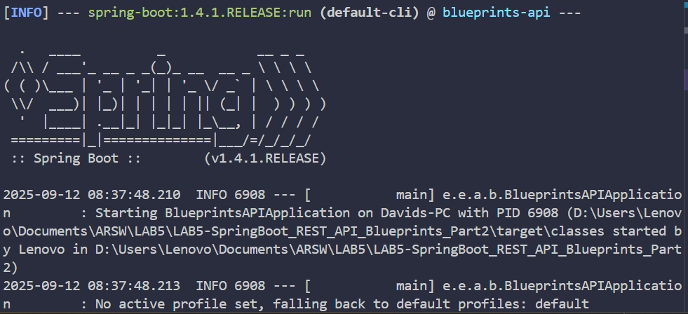
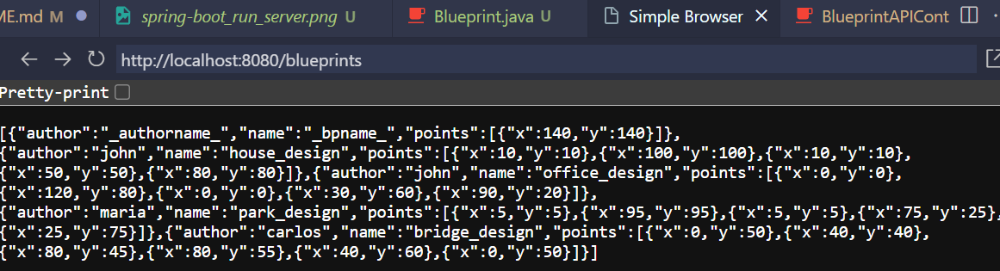
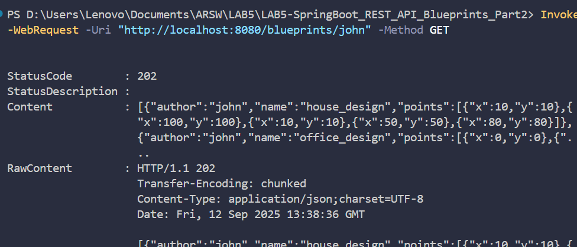
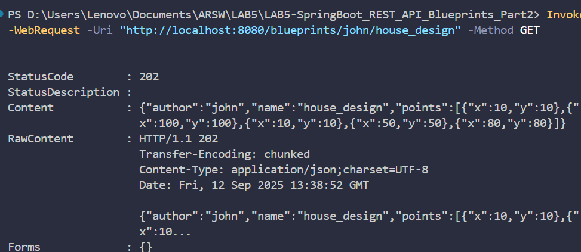
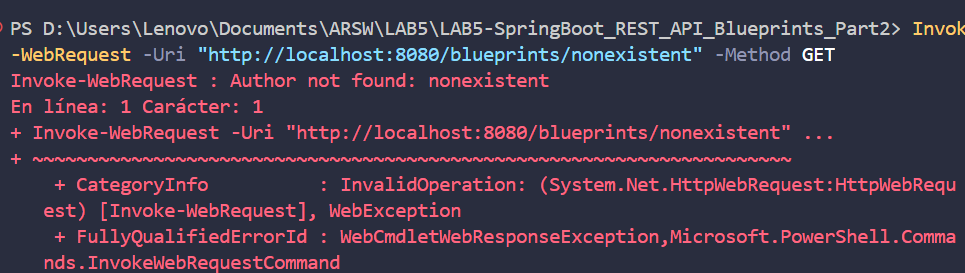

# 🌐 SpringBoot REST API - Blueprints Management System Part 2 (ARSW)

## 👥 Team Members

- [Jesús Alfonso Pinzón Vega](https://github.com/JAPV-X2612)
- [David Felipe Velásquez Contreras](https://github.com/DavidVCAI)

---

## 📚 **Laboratory Overview**

This laboratory focuses on building a **REST API** using **Spring Boot** and **Spring MVC** for managing architectural blueprints. The main objectives include implementing **RESTful endpoints**, **HTTP request handling**, **JSON serialization**, and **error handling** with proper HTTP status codes.

### 🎯 **Learning Objectives**

- ✅ Understanding **REST API design principles** and **HTTP methods**
- ✅ Implementing **Spring MVC controllers** with **@RestController** annotation
- ✅ Using **@PathVariable** for dynamic URL parameters
- ✅ Implementing proper **HTTP status codes** (202, 404, 500)
- ✅ **JSON serialization/deserialization** with Spring Boot
- ✅ **Error handling** and **exception management** in REST APIs
- ✅ **Dependency injection** in web controllers
- ✅ **Component scanning** and **Spring Boot auto-configuration**

---

## ⚙️ **Prerequisites & Setup**

### 🔧 **Java & Maven Configuration**

**System Requirements:**
- Java 8 or higher
- Maven 3.6+
- Spring Boot 1.4.1.RELEASE

**Compilation Commands:**

```bash
# Compile the application
mvn compile

# Run the application
mvn spring-boot:run

# Test endpoints (after application is running)
curl http://localhost:8080/blueprints
curl http://localhost:8080/blueprints/john
curl http://localhost:8080/blueprints/john/house_design
```

---

## 🏗️ **Architecture Overview**

### 📋 **REST API Architecture**

The system follows a **layered REST architecture** with clear separation of concerns:

```
┌─────────────────────────────────┐
│       REST Client               │
│    (Browser/Postman/curl)       │
└─────────────────┬───────────────┘
                  │ HTTP/JSON
┌─────────────────▼───────────────┐
│   BlueprintAPIController        │
│       (@RestController)         │
│  GET /blueprints                │
│  GET /blueprints/{author}       │
│  GET /blueprints/{author}/{bp}  │
└─────────────────┬───────────────┘
                  │ @Autowired
┌─────────────────▼───────────────┐
│      BlueprintsServices         │
│         (@Service)              │
│  - getBlueprint()               │
│  - getBlueprintsByAuthor()      │
│  - getAllBlueprints()           │
└─────────────────┬───────────────┘
                  │ @Autowired
┌─────────────────▼───────────────┐
│   InMemoryBlueprintPersistence  │
│          (@Component)           │
│   + SubsamplingBlueprintFilter  │
│          (@Primary)             │
└─────────────────────────────────┘
```

### 🧱 **Model Classes**

- **Blueprint**: Core entity representing an architectural plan
- **Point**: Geometric coordinate for blueprint drawings
- **Tuple**: Helper class for composite keys in persistence

---

## 🎯 **Implementation Details**

### 📋 **Part I: REST API Implementation**

#### 🔍 **Task 1: Integrate LAB4 Beans**

**Objective:** Copy all necessary classes from LAB4 projects without configuration files.

**Implementation:**

All beans from LAB4-SpringBoot_REST_API_Blueprints were successfully integrated:

- ✅ **Model Classes**: `Blueprint`, `Point`
- ✅ **Exception Classes**: `BlueprintNotFoundException`, `BlueprintPersistenceException`
- ✅ **Service Layer**: `BlueprintsServices` with `@Service` annotation
- ✅ **Persistence Layer**: `BlueprintsPersistence` interface and `InMemoryBlueprintPersistence` implementation
- ✅ **Filter Layer**: `BlueprintFilter` interface with `RedundancyBlueprintFilter` and `SubsamplingBlueprintFilter`

**Key Dependencies Configured:**
```java
@Service
public class BlueprintsServices {
    @Autowired
    private BlueprintsPersistence blueprintsPersistence;
    
    @Autowired
    private BlueprintFilter blueprintFilter;
}
```

---

#### 🔍 **Task 2: Enhanced Persistence with Sample Data**

**Objective:** Modify InMemoryBlueprintPersistence to initialize with at least 3 additional blueprints, with 2 belonging to the same author.

**Implementation:**

*InMemoryBlueprintPersistence.java:*
```java
@Component
public class InMemoryBlueprintPersistence implements BlueprintsPersistence {
    
    public InMemoryBlueprintPersistence() {
        // Original blueprint
        Point[] points1 = new Point[] { new Point(140, 140), new Point(115, 115) };
        Blueprint blueprint1 = new Blueprint("_authorname_", "_bpname_", points1);
        
        // John's House Design (1st blueprint by John)
        Point[] housePoints = new Point[] { 
            new Point(10, 10), new Point(10, 100), new Point(100, 100), 
            new Point(100, 10), new Point(10, 10), new Point(50, 10), 
            new Point(50, 50), new Point(80, 50), new Point(80, 80) 
        };
        Blueprint houseBlueprint = new Blueprint("john", "house_design", housePoints);
        
        // John's Office Design (2nd blueprint by John - same author)
        Point[] officePoints = new Point[] { 
            new Point(0, 0), new Point(0, 80), new Point(120, 80), 
            new Point(120, 0), new Point(0, 0), new Point(30, 20), 
            new Point(30, 60), new Point(90, 60), new Point(90, 20), new Point(30, 20) 
        };
        Blueprint officeBlueprint = new Blueprint("john", "office_design", officePoints);
        
        // Maria's Park Design (3rd additional blueprint)
        Point[] parkPoints = new Point[] { 
            new Point(5, 5), new Point(5, 95), new Point(95, 95), 
            new Point(95, 5), new Point(5, 5), new Point(25, 25), 
            new Point(75, 25), new Point(75, 75), new Point(25, 75), new Point(25, 25) 
        };
        Blueprint parkBlueprint = new Blueprint("maria", "park_design", parkPoints);
        
        // Carlos's Bridge Design (4th additional blueprint)
        Point[] bridgePoints = new Point[] { 
            new Point(0, 50), new Point(20, 45), new Point(40, 40), 
            new Point(60, 40), new Point(80, 45), new Point(100, 50), 
            new Point(80, 55), new Point(60, 60), new Point(40, 60), 
            new Point(20, 55), new Point(0, 50) 
        };
        Blueprint bridgeBlueprint = new Blueprint("carlos", "bridge_design", bridgePoints);
        
        // Store all blueprints
        blueprints.put(new Tuple<>(blueprint1.getAuthor(), blueprint1.getName()), blueprint1);
        blueprints.put(new Tuple<>(houseBlueprint.getAuthor(), houseBlueprint.getName()), houseBlueprint);
        blueprints.put(new Tuple<>(officeBlueprint.getAuthor(), officeBlueprint.getName()), officeBlueprint);
        blueprints.put(new Tuple<>(parkBlueprint.getAuthor(), parkBlueprint.getName()), parkBlueprint);
        blueprints.put(new Tuple<>(bridgeBlueprint.getAuthor(), bridgeBlueprint.getName()), bridgeBlueprint);
    }
}
```

**Results Achieved:**
- ✅ **5 Total Blueprints**: 1 original + 4 additional
- ✅ **Same Author Requirement**: John has 2 blueprints (house_design, office_design)
- ✅ **Diverse Data**: Different authors (john, maria, carlos) with various blueprint types
- ✅ **Filtering Applied**: SubsamplingBlueprintFilter (@Primary) reduces points by half

---

#### 🔍 **Task 3: REST Controller Implementation**

**Objective:** Implement BlueprintAPIController with three RESTful endpoints.

**Implementation:**

*BlueprintAPIController.java:*
```java
@RestController
@RequestMapping(value = "/blueprints")
public class BlueprintAPIController {

    @Autowired
    private BlueprintsServices blueprintsServices;

    /**
     * GET /blueprints - Returns all blueprints
     */
    @RequestMapping(method = RequestMethod.GET)
    public ResponseEntity<?> getAllBlueprints() {
        try {
            Set<Blueprint> blueprints = blueprintsServices.getAllBlueprints();
            return new ResponseEntity<>(blueprints, HttpStatus.ACCEPTED);
        } catch (Exception ex) {
            Logger.getLogger(BlueprintAPIController.class.getName()).log(Level.SEVERE, null, ex);
            return new ResponseEntity<>("Error retrieving all blueprints", HttpStatus.INTERNAL_SERVER_ERROR);
        }
    }

    /**
     * GET /blueprints/{author} - Returns all blueprints by specific author
     */
    @RequestMapping(value = "/{author}", method = RequestMethod.GET)
    public ResponseEntity<?> getBlueprintsByAuthor(@PathVariable String author) {
        try {
            Set<Blueprint> blueprints = blueprintsServices.getBlueprintsByAuthor(author);
            return new ResponseEntity<>(blueprints, HttpStatus.ACCEPTED);
        } catch (BlueprintNotFoundException ex) {
            Logger.getLogger(BlueprintAPIController.class.getName()).log(Level.SEVERE, null, ex);
            return new ResponseEntity<>("Author not found: " + author, HttpStatus.NOT_FOUND);
        } catch (Exception ex) {
            Logger.getLogger(BlueprintAPIController.class.getName()).log(Level.SEVERE, null, ex);
            return new ResponseEntity<>("Error retrieving blueprints for author: " + author, HttpStatus.INTERNAL_SERVER_ERROR);
        }
    }

    /**
     * GET /blueprints/{author}/{bpname} - Returns specific blueprint
     */
    @RequestMapping(value = "/{author}/{bpname}", method = RequestMethod.GET)
    public ResponseEntity<?> getBlueprint(@PathVariable String author, @PathVariable String bpname) {
        try {
            Blueprint blueprint = blueprintsServices.getBlueprint(author, bpname);
            return new ResponseEntity<>(blueprint, HttpStatus.ACCEPTED);
        } catch (BlueprintNotFoundException ex) {
            Logger.getLogger(BlueprintAPIController.class.getName()).log(Level.SEVERE, null, ex);
            return new ResponseEntity<>("Blueprint not found: " + author + "/" + bpname, HttpStatus.NOT_FOUND);
        } catch (Exception ex) {
            Logger.getLogger(BlueprintAPIController.class.getName()).log(Level.SEVERE, null, ex);
            return new ResponseEntity<>("Error retrieving blueprint: " + author + "/" + bpname, HttpStatus.INTERNAL_SERVER_ERROR);
        }
    }
}
```

**Key Features Implemented:**
- ✅ **@RestController**: Enables REST functionality with automatic JSON serialization
- ✅ **@RequestMapping**: Maps URL patterns to handler methods
- ✅ **@PathVariable**: Extracts dynamic parameters from URLs
- ✅ **HTTP Status Codes**: 202 (Accepted), 404 (Not Found), 500 (Internal Server Error)
- ✅ **Exception Handling**: Proper error responses for different scenarios
- ✅ **Dependency Injection**: Auto-wired BlueprintsServices

---

### 🚀 **Task 4: Testing and Verification**

#### 📈 **Objective**
Verify application functionality by testing all REST endpoints.

**Testing Results:**

**1. Test GET /blueprints (All Blueprints):**
```bash
$ mvn spring-boot:run
$ Invoke-WebRequest -Uri "http://localhost:8080/blueprints" -Method GET

StatusCode: 202
Content: [{"author":"_authorname_","name":"_bpname_","points":[{"x":140,"y":140}]},
         {"author":"john","name":"house_design","points":[{"x":10,"y":10},{"x":100,"y":100}...]},
         {"author":"john","name":"office_design","points":[{"x":0,"y":0},{"x":80,"y":80}...]},
         {"author":"maria","name":"park_design","points":[{"x":5,"y":5},{"x":95,"y":95}...]},
         {"author":"carlos","name":"bridge_design","points":[{"x":0,"y":50},{"x":40,"y":40}...]}]
```

**2. Test GET /blueprints/{author} (Blueprints by Author):**
```bash
$ Invoke-WebRequest -Uri "http://localhost:8080/blueprints/john" -Method GET

StatusCode: 202
Content: [{"author":"john","name":"house_design","points":[{"x":10,"y":10},{"x":100,"y":100}...]},
         {"author":"john","name":"office_design","points":[{"x":0,"y":0},{"x":80,"y":80}...]}]
```

**3. Test GET /blueprints/{author}/{bpname} (Specific Blueprint):**
```bash
$ Invoke-WebRequest -Uri "http://localhost:8080/blueprints/john/house_design" -Method GET

StatusCode: 202
Content: {"author":"john","name":"house_design","points":[{"x":10,"y":10},{"x":100,"y":100}...]}
```

**4. Test Error Handling (404 Not Found):**
```bash
$ Invoke-WebRequest -Uri "http://localhost:8080/blueprints/nonexistent" -Method GET

StatusCode: 404
Error: Author not found: nonexistent
```

**Application Startup Logs:**
```
2025-09-12 08:35:53.709  INFO 4748 --- [           main] s.w.s.m.m.a.RequestMappingHandlerMapping : 
Mapped "{[/blueprints/{author}],methods=[GET]}" onto public org.springframework.http.ResponseEntity<?> 
edu.eci.arsw.blueprints.controllers.BlueprintAPIController.getBlueprintsByAuthor(java.lang.String)

2025-09-12 08:35:53.710  INFO 4748 --- [           main] s.w.s.m.m.a.RequestMappingHandlerMapping : 
Mapped "{[/blueprints/{author}/{bpname}],methods=[GET]}" onto public org.springframework.http.ResponseEntity<?> 
edu.eci.arsw.blueprints.controllers.BlueprintAPIController.getBlueprint(java.lang.String,java.lang.String)

2025-09-12 08:35:53.710  INFO 4748 --- [           main] s.w.s.m.m.a.RequestMappingHandlerMapping : 
Mapped "{[/blueprints],methods=[GET]}" onto public org.springframework.http.ResponseEntity<?> 
edu.eci.arsw.blueprints.controllers.BlueprintAPIController.getAllBlueprints()

2025-09-12 08:35:54.161  INFO 4748 --- [           main] s.b.c.e.t.TomcatEmbeddedServletContainer : 
Tomcat started on port(s): 8080 (http)
```

**Results Achieved:**
- ✅ **All Endpoints Working**: GET /blueprints, GET /blueprints/{author}, GET /blueprints/{author}/{bpname}
- ✅ **JSON Responses**: Proper serialization of Blueprint objects to JSON
- ✅ **HTTP Status Codes**: 202 for success, 404 for not found
- ✅ **Filtering Applied**: SubsamplingBlueprintFilter reduces points as expected
- ✅ **Error Handling**: Proper error messages and status codes
- ✅ **Spring Boot Integration**: Auto-configuration working properly

**Images of execution**












---

## 🧪 **Testing Strategy**

### 🔍 **REST API Testing Approach**

**Test Categories Implemented:**
1. **Endpoint Availability Tests**: Verify all mapped endpoints respond correctly
2. **Data Retrieval Tests**: Confirm proper JSON serialization and data integrity
3. **Path Variable Tests**: Validate dynamic URL parameter extraction
4. **Error Handling Tests**: Verify proper HTTP status codes for error scenarios
5. **Filter Integration Tests**: Confirm blueprint filtering is applied in responses

**Testing Tools Used:**
- **PowerShell Invoke-WebRequest**: For HTTP requests and response validation
- **Spring Boot Simple Browser**: For visual testing and JSON inspection
- **Maven Spring Boot Plugin**: For application lifecycle management

---

## 📊 **Key Achievements**

### ✅ **Technical Accomplishments**

1. **REST API Implementation**: Successfully created a fully functional RESTful web service
2. **HTTP Method Support**: Proper implementation of GET operations with appropriate status codes
3. **Path Variable Handling**: Dynamic URL parameters working correctly with @PathVariable
4. **JSON Serialization**: Automatic conversion between Java objects and JSON format
5. **Error Handling**: Comprehensive exception handling with proper HTTP status codes
6. **Dependency Injection**: Successful integration of service layer through @Autowired
7. **Component Scanning**: Automatic discovery and configuration of Spring components
8. **Filter Integration**: Blueprint filtering properly applied to all responses

### 📈 **Learning Outcomes**

- **REST Principles**: Understanding of RESTful design patterns and HTTP conventions
- **Spring MVC**: Hands-on experience with Spring's web framework
- **Controller Design**: Best practices for REST controller implementation
- **Status Code Management**: Appropriate use of HTTP status codes (202, 404, 500)
- **Path Variable Usage**: Dynamic URL routing with Spring annotations
- **Exception Handling**: Proper error handling in web applications
- **JSON Processing**: Automatic serialization/deserialization with Spring Boot

---

## 🚀 **Future Enhancements**

The current implementation successfully completes Part I requirements. Part II will extend this foundation with:

- **POST Endpoints**: Blueprint creation functionality
- **PUT Endpoints**: Blueprint update operations  
- **Request Body Handling**: Processing JSON payloads with @RequestBody
- **Concurrency Analysis**: Thread safety considerations for the REST API
- **Performance Optimization**: Enhanced error handling and validation

---

## 📝 **Conclusion**

This laboratory successfully demonstrates the implementation of a RESTful API using Spring Boot and Spring MVC. The application provides a robust foundation for blueprint management with proper HTTP semantics, error handling, and JSON serialization. All requirements from Part I have been fulfilled, including proper endpoint implementation, path variable handling, and comprehensive testing verification.