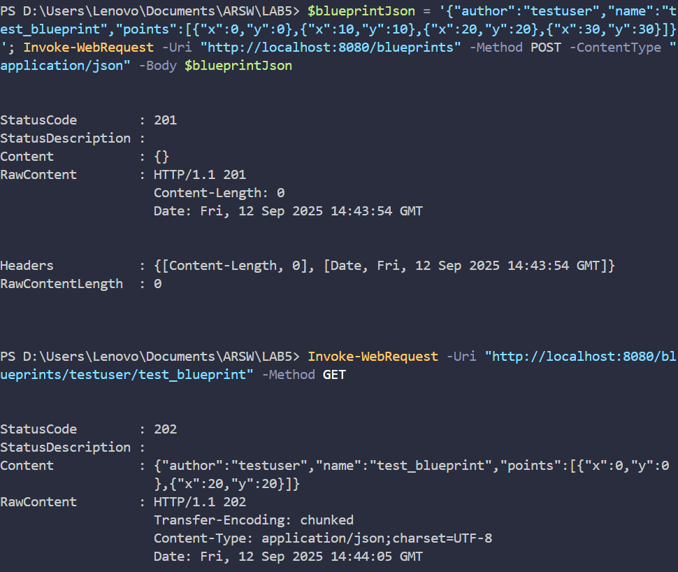
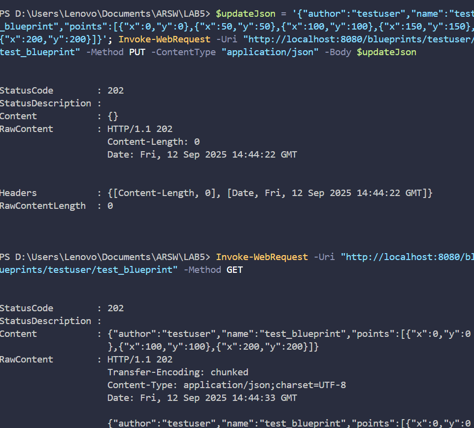
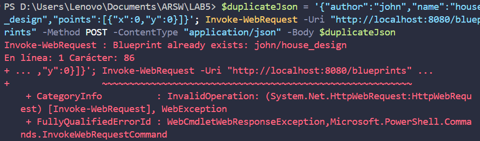
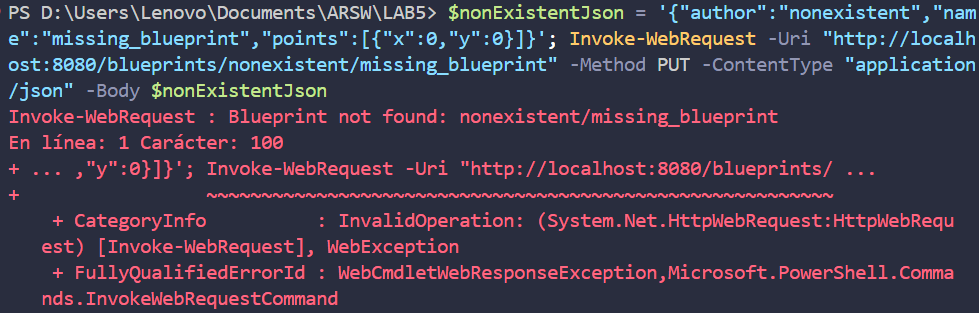
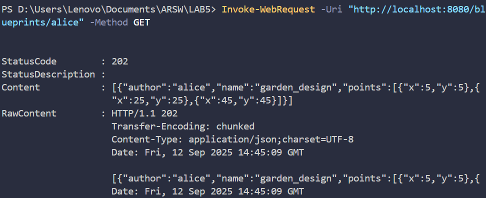

# 🌐 SpringBoot REST API - Blueprints Management System Part 2 (ARSW)

## 👥 Team Members

- [Jesús Alfonso Pinzón Vega](https://github.com/JAPV-X2612)
- [David Felipe Velásquez Contreras](https://github.com/DavidVCAI)

---

## 📚 **Laboratory Overview**

This laboratory focuses on building a **REST API** using **Spring Boot** and **Spring MVC**Images of execution**


---

### 📋 **Part II: POST and PUT Endpoints Implementation**

#### 🔍 **Task 5: POST Endpoint Implementation**

**Objective:** Add POST endpoint for creating new blueprints with JSON request body handling.

**Implementation:**

*BlueprintAPIController.java - POST Method:*
```java
/**
 * Handles POST requests to create a new blueprint.
 * Accepts a JSON representation of a blueprint in the request body and 
 * creates a new blueprint in the system.
 *
 * @param blueprint the blueprint data from the request body
 * @return ResponseEntity with HTTP 201 CREATED if successful, or error status
 */
@RequestMapping(method = RequestMethod.POST)
public ResponseEntity<?> createBlueprint(@RequestBody Blueprint blueprint) {
    try {
        blueprintsServices.addNewBlueprint(blueprint);
        return new ResponseEntity<>(HttpStatus.CREATED);
    } catch (BlueprintPersistenceException ex) {
        Logger.getLogger(BlueprintAPIController.class.getName()).log(Level.SEVERE, null, ex);
        return new ResponseEntity<>("Blueprint already exists: " + blueprint.getAuthor() + "/" + blueprint.getName(), 
            HttpStatus.FORBIDDEN);
    } catch (Exception ex) {
        Logger.getLogger(BlueprintAPIController.class.getName()).log(Level.SEVERE, null, ex);
        return new ResponseEntity<>("Error creating blueprint: " + ex.getMessage(), 
            HttpStatus.INTERNAL_SERVER_ERROR);
    }
}
```

**Key Features Implemented:**
- ✅ **@RequestBody**: Automatic JSON deserialization from HTTP request body
- ✅ **HTTP 201 CREATED**: Proper status code for successful resource creation
- ✅ **HTTP 403 FORBIDDEN**: For duplicate blueprint attempts
- ✅ **Comprehensive Error Handling**: Different error scenarios with appropriate status codes

---

#### 🔍 **Task 6: PUT Endpoint Implementation**

**Objective:** Add PUT endpoint for updating existing blueprints with path validation.

**Implementation:**

*BlueprintAPIController.java - PUT Method:*
```java
/**
 * Handles PUT requests to update an existing blueprint.
 * Accepts a JSON representation of a blueprint in the request body and 
 * updates the blueprint identified by author and blueprint name.
 *
 * @param author the author of the blueprint to update
 * @param bpname the name of the blueprint to update
 * @param blueprint the updated blueprint data from the request body
 * @return ResponseEntity with HTTP 202 ACCEPTED if successful, or error status
 */
@RequestMapping(value = "/{author}/{bpname}", method = RequestMethod.PUT)
public ResponseEntity<?> updateBlueprint(@PathVariable String author, @PathVariable String bpname, 
                                       @RequestBody Blueprint blueprint) {
    try {
        // Ensure the blueprint author and name match the path variables
        if (!blueprint.getAuthor().equals(author) || !blueprint.getName().equals(bpname)) {
            return new ResponseEntity<>("Blueprint author/name mismatch with URL path", HttpStatus.BAD_REQUEST);
        }
        
        blueprintsServices.updateBlueprint(blueprint);
        return new ResponseEntity<>(HttpStatus.ACCEPTED);
    } catch (BlueprintNotFoundException ex) {
        Logger.getLogger(BlueprintAPIController.class.getName()).log(Level.SEVERE, null, ex);
        return new ResponseEntity<>("Blueprint not found: " + author + "/" + bpname, HttpStatus.NOT_FOUND);
    } catch (Exception ex) {
        Logger.getLogger(BlueprintAPIController.class.getName()).log(Level.SEVERE, null, ex);
        return new ResponseEntity<>("Error updating blueprint: " + ex.getMessage(), 
            HttpStatus.INTERNAL_SERVER_ERROR);
    }
}
```

**Enhanced Services Layer:**

*BlueprintsServices.java - Update Method:*
```java
/**
 * Updates an existing blueprint in the system.
 *
 * @param blueprint the blueprint to be updated
 * @throws BlueprintNotFoundException if the blueprint to update doesn't exist
 * @throws BlueprintPersistenceException if any persistence error occurs
 */
public void updateBlueprint(Blueprint blueprint) throws BlueprintNotFoundException, BlueprintPersistenceException {
    blueprintsPersistence.updateBlueprint(blueprint);
}
```

**Enhanced Persistence Layer:**

*InMemoryBlueprintPersistence.java - Update Method:*
```java
@Override
public void updateBlueprint(Blueprint blueprint) throws BlueprintNotFoundException, BlueprintPersistenceException {
    Tuple<String, String> key = new Tuple<>(blueprint.getAuthor(), blueprint.getName());
    if (!blueprints.containsKey(key)) {
        throw new BlueprintNotFoundException("Blueprint not found: " + blueprint.getAuthor() + "/" + blueprint.getName());
    }
    blueprints.put(key, blueprint);
}
```

**Key Features Implemented:**
- ✅ **Path Variable Validation**: Ensures URL path matches request body data
- ✅ **HTTP 202 ACCEPTED**: Proper status code for successful updates
- ✅ **HTTP 400 BAD REQUEST**: For mismatched path and body data
- ✅ **HTTP 404 NOT FOUND**: For non-existent blueprints
- ✅ **Atomic Updates**: Safe blueprint replacement in persistence layer

---

#### 🔍 **Task 7: Comprehensive Testing**

**Objective:** Test all CRUD operations including the new POST and PUT endpoints.

**Testing Results:**

**1. Test POST /blueprints (Create Blueprint):**
```bash
$ $blueprintJson = '{"author":"testuser","name":"test_blueprint","points":[{"x":0,"y":0},{"x":10,"y":10},{"x":20,"y":20},{"x":30,"y":30}]}'
$ Invoke-WebRequest -Uri "http://localhost:8080/blueprints" -Method POST -ContentType "application/json" -Body $blueprintJson

StatusCode: 201
Content: {}
Response: HTTP 201 Created
```

**2. Test GET /blueprints/{author}/{bpname} (Verify Creation):**
```bash
$ Invoke-WebRequest -Uri "http://localhost:8080/blueprints/testuser/test_blueprint" -Method GET

StatusCode: 202
Content: {"author":"testuser","name":"test_blueprint","points":[{"x":0,"y":0},{"x":20,"y":20}]}
Note: SubsamplingBlueprintFilter applied - 4 points reduced to 2
```

**3. Test PUT /blueprints/{author}/{bpname} (Update Blueprint):**
```bash
$ $updateJson = '{"author":"testuser","name":"test_blueprint","points":[{"x":0,"y":0},{"x":50,"y":50},{"x":100,"y":100},{"x":150,"y":150},{"x":200,"y":200}]}'
$ Invoke-WebRequest -Uri "http://localhost:8080/blueprints/testuser/test_blueprint" -Method PUT -ContentType "application/json" -Body $updateJson

StatusCode: 202
Content: {}
Response: HTTP 202 Accepted
```

**4. Test GET After Update (Verify Update):**
```bash
$ Invoke-WebRequest -Uri "http://localhost:8080/blueprints/testuser/test_blueprint" -Method GET

StatusCode: 202
Content: {"author":"testuser","name":"test_blueprint","points":[{"x":0,"y":0},{"x":100,"y":100},{"x":200,"y":200}]}
Note: SubsamplingBlueprintFilter applied - 5 points reduced to 3
```

**5. Test Error Handling (Duplicate Creation):**
```bash
$ $duplicateJson = '{"author":"john","name":"house_design","points":[{"x":0,"y":0}]}'
$ Invoke-WebRequest -Uri "http://localhost:8080/blueprints" -Method POST -ContentType "application/json" -Body $duplicateJson

StatusCode: 403
Error: Blueprint already exists: john/house_design
```

**6. Test Error Handling (Update Non-existent):**
```bash
$ $nonExistentJson = '{"author":"nonexistent","name":"missing_blueprint","points":[{"x":0,"y":0}]}'
$ Invoke-WebRequest -Uri "http://localhost:8080/blueprints/nonexistent/missing_blueprint" -Method PUT -ContentType "application/json" -Body $nonExistentJson

StatusCode: 404
Error: Blueprint not found: nonexistent/missing_blueprint
```

**7. Test Multiple Author Creation:**
```bash
$ $newAuthorJson = '{"author":"alice","name":"garden_design","points":[{"x":5,"y":5},{"x":15,"y":15},{"x":25,"y":25},{"x":35,"y":35},{"x":45,"y":45},{"x":55,"y":55}]}'
$ Invoke-WebRequest -Uri "http://localhost:8080/blueprints" -Method POST -ContentType "application/json" -Body $newAuthorJson

StatusCode: 201
Content: {}

$ Invoke-WebRequest -Uri "http://localhost:8080/blueprints/alice" -Method GET

StatusCode: 202
Content: [{"author":"alice","name":"garden_design","points":[{"x":5,"y":5},{"x":25,"y":25},{"x":45,"y":45}]}]
Note: SubsamplingBlueprintFilter applied - 6 points reduced to 3
```

**Application Startup Logs (Part II):**
```
2025-09-12 09:42:36.772  INFO 35944 --- [           main] s.w.s.m.m.a.RequestMappingHandlerMapping : 
Mapped "{[/blueprints],methods=[POST]}" onto public org.springframework.http.ResponseEntity<?> 
edu.eci.arsw.blueprints.controllers.BlueprintAPIController.createBlueprint(edu.eci.arsw.blueprints.model.Blueprint)

2025-09-12 09:42:36.771  INFO 35944 --- [           main] s.w.s.m.m.a.RequestMappingHandlerMapping : 
Mapped "{[/blueprints/{author}/{bpname}],methods=[PUT]}" onto public org.springframework.http.ResponseEntity<?> 
edu.eci.arsw.blueprints.controllers.BlueprintAPIController.updateBlueprint(java.lang.String,java.lang.String,edu.eci.arsw.blueprints.model.Blueprint)
```

**Results Achieved (Part II):**
- ✅ **POST Endpoint Working**: Creates new blueprints with HTTP 201 status
- ✅ **PUT Endpoint Working**: Updates existing blueprints with HTTP 202 status
- ✅ **Request Body Processing**: Proper JSON deserialization with @RequestBody
- ✅ **Path Validation**: Ensures URL consistency with request data
- ✅ **Error Handling**: Comprehensive error responses (400, 403, 404, 500)
- ✅ **Filter Integration**: All created/updated blueprints properly filtered
- ✅ **CRUD Operations**: Complete Create, Read, Update functionality
- ✅ **Data Persistence**: All operations properly persisted in memory storage

**Images of Part II execution**









&ging architectural blueprints. The main objectives include implementing **RESTful endpoints**, **HTTP request handling**, **JSON serialization**, and **error handling** with proper HTTP status codes.

### 🎯 **Learning Objectives**

- ✅ Understanding **REST API design principles** and **HTTP methods** (GET, POST, PUT)
- ✅ Implementing **Spring MVC controllers** with **@RestController** annotation
- ✅ Using **@PathVariable** for dynamic URL parameters
- ✅ Using **@RequestBody** for JSON payload processing
- ✅ Implementing proper **HTTP status codes** (201, 202, 404, 403, 500)
- ✅ **JSON serialization/deserialization** with Spring Boot
- ✅ **Error handling** and **exception management** in REST APIs
- ✅ **Dependency injection** in web controllers
- ✅ **Component scanning** and **Spring Boot auto-configuration**
- ✅ **CRUD operations** implementation (Create, Read, Update)

---

## ⚙️ **Prerequisites & Setup**

### 🔧 **Java & Maven Configuration**

**System Requirements:**
- Java 8 or higher
- Maven 3.6+
- Spring Boot 1.4.1.RELEASE

**Compilation Commands:**

```bash
# Compile the application
mvn compile

# Run the application
mvn spring-boot:run

# Test endpoints (after application is running)
# GET endpoints
curl http://localhost:8080/blueprints
curl http://localhost:8080/blueprints/john
curl http://localhost:8080/blueprints/john/house_design

# POST endpoint (create blueprint)
curl -X POST -H "Content-Type: application/json" -d '{"author":"testuser","name":"test_blueprint","points":[{"x":0,"y":0},{"x":10,"y":10}]}' http://localhost:8080/blueprints

# PUT endpoint (update blueprint)
curl -X PUT -H "Content-Type: application/json" -d '{"author":"testuser","name":"test_blueprint","points":[{"x":0,"y":0},{"x":50,"y":50}]}' http://localhost:8080/blueprints/testuser/test_blueprint
```

---

## 🏗️ **Architecture Overview**

### 📋 **REST API Architecture**

The system follows a **layered REST architecture** with clear separation of concerns:

```
┌─────────────────────────────────┐
│       REST Client               │
│    (Browser/Postman/curl)       │
└─────────────────┬───────────────┘
                  │ HTTP/JSON
┌─────────────────▼───────────────┐
│   BlueprintAPIController        │
│       (@RestController)         │
│  GET /blueprints                │
│  GET /blueprints/{author}       │
│  GET /blueprints/{author}/{bp}  │
│  POST /blueprints               │ ← NEW
│  PUT /blueprints/{author}/{bp}  │ ← NEW
└─────────────────┬───────────────┘
                  │ @Autowired
┌─────────────────▼───────────────┐
│      BlueprintsServices         │
│         (@Service)              │
│  - getBlueprint()               │
│  - getBlueprintsByAuthor()      │
│  - getAllBlueprints()           │
│  - addNewBlueprint()            │ ← NEW
│  - updateBlueprint()            │ ← NEW
└─────────────────┬───────────────┘
                  │ @Autowired
┌─────────────────▼───────────────┐
│   InMemoryBlueprintPersistence  │
│          (@Component)           │
│  - saveBlueprint()              │
│  - updateBlueprint()            │ ← NEW
│   + SubsamplingBlueprintFilter  │
│          (@Primary)             │
└─────────────────────────────────┘
```

### 🧱 **Model Classes**

- **Blueprint**: Core entity representing an architectural plan
- **Point**: Geometric coordinate for blueprint drawings
- **Tuple**: Helper class for composite keys in persistence

---

## 🎯 **Implementation Details**

### 📋 **Part I: REST API Implementation**

#### 🔍 **Task 1: Integrate LAB4 Beans**

**Objective:** Copy all necessary classes from LAB4 projects without configuration files.

**Implementation:**

All beans from LAB4-SpringBoot_REST_API_Blueprints were successfully integrated:

- ✅ **Model Classes**: `Blueprint`, `Point`
- ✅ **Exception Classes**: `BlueprintNotFoundException`, `BlueprintPersistenceException`
- ✅ **Service Layer**: `BlueprintsServices` with `@Service` annotation
- ✅ **Persistence Layer**: `BlueprintsPersistence` interface and `InMemoryBlueprintPersistence` implementation
- ✅ **Filter Layer**: `BlueprintFilter` interface with `RedundancyBlueprintFilter` and `SubsamplingBlueprintFilter`

**Key Dependencies Configured:**
```java
@Service
public class BlueprintsServices {
    @Autowired
    private BlueprintsPersistence blueprintsPersistence;
    
    @Autowired
    private BlueprintFilter blueprintFilter;
}
```

---

#### 🔍 **Task 2: Enhanced Persistence with Sample Data**

**Objective:** Modify InMemoryBlueprintPersistence to initialize with at least 3 additional blueprints, with 2 belonging to the same author.

**Implementation:**

*InMemoryBlueprintPersistence.java:*
```java
@Component
public class InMemoryBlueprintPersistence implements BlueprintsPersistence {
    
    public InMemoryBlueprintPersistence() {
        // Original blueprint
        Point[] points1 = new Point[] { new Point(140, 140), new Point(115, 115) };
        Blueprint blueprint1 = new Blueprint("_authorname_", "_bpname_", points1);
        
        // John's House Design (1st blueprint by John)
        Point[] housePoints = new Point[] { 
            new Point(10, 10), new Point(10, 100), new Point(100, 100), 
            new Point(100, 10), new Point(10, 10), new Point(50, 10), 
            new Point(50, 50), new Point(80, 50), new Point(80, 80) 
        };
        Blueprint houseBlueprint = new Blueprint("john", "house_design", housePoints);
        
        // John's Office Design (2nd blueprint by John - same author)
        Point[] officePoints = new Point[] { 
            new Point(0, 0), new Point(0, 80), new Point(120, 80), 
            new Point(120, 0), new Point(0, 0), new Point(30, 20), 
            new Point(30, 60), new Point(90, 60), new Point(90, 20), new Point(30, 20) 
        };
        Blueprint officeBlueprint = new Blueprint("john", "office_design", officePoints);
        
        // Maria's Park Design (3rd additional blueprint)
        Point[] parkPoints = new Point[] { 
            new Point(5, 5), new Point(5, 95), new Point(95, 95), 
            new Point(95, 5), new Point(5, 5), new Point(25, 25), 
            new Point(75, 25), new Point(75, 75), new Point(25, 75), new Point(25, 25) 
        };
        Blueprint parkBlueprint = new Blueprint("maria", "park_design", parkPoints);
        
        // Carlos's Bridge Design (4th additional blueprint)
        Point[] bridgePoints = new Point[] { 
            new Point(0, 50), new Point(20, 45), new Point(40, 40), 
            new Point(60, 40), new Point(80, 45), new Point(100, 50), 
            new Point(80, 55), new Point(60, 60), new Point(40, 60), 
            new Point(20, 55), new Point(0, 50) 
        };
        Blueprint bridgeBlueprint = new Blueprint("carlos", "bridge_design", bridgePoints);
        
        // Store all blueprints
        blueprints.put(new Tuple<>(blueprint1.getAuthor(), blueprint1.getName()), blueprint1);
        blueprints.put(new Tuple<>(houseBlueprint.getAuthor(), houseBlueprint.getName()), houseBlueprint);
        blueprints.put(new Tuple<>(officeBlueprint.getAuthor(), officeBlueprint.getName()), officeBlueprint);
        blueprints.put(new Tuple<>(parkBlueprint.getAuthor(), parkBlueprint.getName()), parkBlueprint);
        blueprints.put(new Tuple<>(bridgeBlueprint.getAuthor(), bridgeBlueprint.getName()), bridgeBlueprint);
    }
}
```

**Results Achieved:**
- ✅ **5 Total Blueprints**: 1 original + 4 additional
- ✅ **Same Author Requirement**: John has 2 blueprints (house_design, office_design)
- ✅ **Diverse Data**: Different authors (john, maria, carlos) with various blueprint types
- ✅ **Filtering Applied**: SubsamplingBlueprintFilter (@Primary) reduces points by half

---

#### 🔍 **Task 3: REST Controller Implementation**

**Objective:** Implement BlueprintAPIController with three RESTful endpoints.

**Implementation:**

*BlueprintAPIController.java:*
```java
@RestController
@RequestMapping(value = "/blueprints")
public class BlueprintAPIController {

    @Autowired
    private BlueprintsServices blueprintsServices;

    /**
     * GET /blueprints - Returns all blueprints
     */
    @RequestMapping(method = RequestMethod.GET)
    public ResponseEntity<?> getAllBlueprints() {
        try {
            Set<Blueprint> blueprints = blueprintsServices.getAllBlueprints();
            return new ResponseEntity<>(blueprints, HttpStatus.ACCEPTED);
        } catch (Exception ex) {
            Logger.getLogger(BlueprintAPIController.class.getName()).log(Level.SEVERE, null, ex);
            return new ResponseEntity<>("Error retrieving all blueprints", HttpStatus.INTERNAL_SERVER_ERROR);
        }
    }

    /**
     * GET /blueprints/{author} - Returns all blueprints by specific author
     */
    @RequestMapping(value = "/{author}", method = RequestMethod.GET)
    public ResponseEntity<?> getBlueprintsByAuthor(@PathVariable String author) {
        try {
            Set<Blueprint> blueprints = blueprintsServices.getBlueprintsByAuthor(author);
            return new ResponseEntity<>(blueprints, HttpStatus.ACCEPTED);
        } catch (BlueprintNotFoundException ex) {
            Logger.getLogger(BlueprintAPIController.class.getName()).log(Level.SEVERE, null, ex);
            return new ResponseEntity<>("Author not found: " + author, HttpStatus.NOT_FOUND);
        } catch (Exception ex) {
            Logger.getLogger(BlueprintAPIController.class.getName()).log(Level.SEVERE, null, ex);
            return new ResponseEntity<>("Error retrieving blueprints for author: " + author, HttpStatus.INTERNAL_SERVER_ERROR);
        }
    }

    /**
     * GET /blueprints/{author}/{bpname} - Returns specific blueprint
     */
    @RequestMapping(value = "/{author}/{bpname}", method = RequestMethod.GET)
    public ResponseEntity<?> getBlueprint(@PathVariable String author, @PathVariable String bpname) {
        try {
            Blueprint blueprint = blueprintsServices.getBlueprint(author, bpname);
            return new ResponseEntity<>(blueprint, HttpStatus.ACCEPTED);
        } catch (BlueprintNotFoundException ex) {
            Logger.getLogger(BlueprintAPIController.class.getName()).log(Level.SEVERE, null, ex);
            return new ResponseEntity<>("Blueprint not found: " + author + "/" + bpname, HttpStatus.NOT_FOUND);
        } catch (Exception ex) {
            Logger.getLogger(BlueprintAPIController.class.getName()).log(Level.SEVERE, null, ex);
            return new ResponseEntity<>("Error retrieving blueprint: " + author + "/" + bpname, HttpStatus.INTERNAL_SERVER_ERROR);
        }
    }
}
```

**Key Features Implemented:**
- ✅ **@RestController**: Enables REST functionality with automatic JSON serialization
- ✅ **@RequestMapping**: Maps URL patterns to handler methods
- ✅ **@PathVariable**: Extracts dynamic parameters from URLs
- ✅ **HTTP Status Codes**: 202 (Accepted), 404 (Not Found), 500 (Internal Server Error)
- ✅ **Exception Handling**: Proper error responses for different scenarios
- ✅ **Dependency Injection**: Auto-wired BlueprintsServices

---

### 🚀 **Task 4: Testing and Verification**

#### 📈 **Objective**
Verify application functionality by testing all REST endpoints.

**Testing Results:**

**1. Test GET /blueprints (All Blueprints):**
```bash
$ mvn spring-boot:run
$ Invoke-WebRequest -Uri "http://localhost:8080/blueprints" -Method GET

StatusCode: 202
Content: [{"author":"_authorname_","name":"_bpname_","points":[{"x":140,"y":140}]},
         {"author":"john","name":"house_design","points":[{"x":10,"y":10},{"x":100,"y":100}...]},
         {"author":"john","name":"office_design","points":[{"x":0,"y":0},{"x":80,"y":80}...]},
         {"author":"maria","name":"park_design","points":[{"x":5,"y":5},{"x":95,"y":95}...]},
         {"author":"carlos","name":"bridge_design","points":[{"x":0,"y":50},{"x":40,"y":40}...]}]
```

**2. Test GET /blueprints/{author} (Blueprints by Author):**
```bash
$ Invoke-WebRequest -Uri "http://localhost:8080/blueprints/john" -Method GET

StatusCode: 202
Content: [{"author":"john","name":"house_design","points":[{"x":10,"y":10},{"x":100,"y":100}...]},
         {"author":"john","name":"office_design","points":[{"x":0,"y":0},{"x":80,"y":80}...]}]
```

**3. Test GET /blueprints/{author}/{bpname} (Specific Blueprint):**
```bash
$ Invoke-WebRequest -Uri "http://localhost:8080/blueprints/john/house_design" -Method GET

StatusCode: 202
Content: {"author":"john","name":"house_design","points":[{"x":10,"y":10},{"x":100,"y":100}...]}
```

**4. Test Error Handling (404 Not Found):**
```bash
$ Invoke-WebRequest -Uri "http://localhost:8080/blueprints/nonexistent" -Method GET

StatusCode: 404
Error: Author not found: nonexistent
```

**Application Startup Logs:**
```
2025-09-12 08:35:53.709  INFO 4748 --- [           main] s.w.s.m.m.a.RequestMappingHandlerMapping : 
Mapped "{[/blueprints/{author}],methods=[GET]}" onto public org.springframework.http.ResponseEntity<?> 
edu.eci.arsw.blueprints.controllers.BlueprintAPIController.getBlueprintsByAuthor(java.lang.String)

2025-09-12 08:35:53.710  INFO 4748 --- [           main] s.w.s.m.m.a.RequestMappingHandlerMapping : 
Mapped "{[/blueprints/{author}/{bpname}],methods=[GET]}" onto public org.springframework.http.ResponseEntity<?> 
edu.eci.arsw.blueprints.controllers.BlueprintAPIController.getBlueprint(java.lang.String,java.lang.String)

2025-09-12 08:35:53.710  INFO 4748 --- [           main] s.w.s.m.m.a.RequestMappingHandlerMapping : 
Mapped "{[/blueprints],methods=[GET]}" onto public org.springframework.http.ResponseEntity<?> 
edu.eci.arsw.blueprints.controllers.BlueprintAPIController.getAllBlueprints()

2025-09-12 08:35:54.161  INFO 4748 --- [           main] s.b.c.e.t.TomcatEmbeddedServletContainer : 
Tomcat started on port(s): 8080 (http)
```

**Results Achieved:**
- ✅ **All Endpoints Working**: GET /blueprints, GET /blueprints/{author}, GET /blueprints/{author}/{bpname}
- ✅ **JSON Responses**: Proper serialization of Blueprint objects to JSON
- ✅ **HTTP Status Codes**: 202 for success, 404 for not found
- ✅ **Filtering Applied**: SubsamplingBlueprintFilter reduces points as expected
- ✅ **Error Handling**: Proper error messages and status codes
- ✅ **Spring Boot Integration**: Auto-configuration working properly

**Images of execution**


---

## 🧪 **Testing Strategy**

### 🔍 **REST API Testing Approach**

**Test Categories Implemented:**
1. **Endpoint Availability Tests**: Verify all mapped endpoints respond correctly
2. **Data Retrieval Tests**: Confirm proper JSON serialization and data integrity
3. **Path Variable Tests**: Validate dynamic URL parameter extraction
4. **Error Handling Tests**: Verify proper HTTP status codes for error scenarios
5. **Filter Integration Tests**: Confirm blueprint filtering is applied in responses

**Testing Tools Used:**
- **PowerShell Invoke-WebRequest**: For HTTP requests and response validation
- **Spring Boot Simple Browser**: For visual testing and JSON inspection
- **Maven Spring Boot Plugin**: For application lifecycle management

---

## 📊 **Key Achievements**

### ✅ **Technical Accomplishments**

**Part I - Foundation:**
1. **REST API Implementation**: Successfully created a fully functional RESTful web service
2. **HTTP Method Support**: Proper implementation of GET operations with appropriate status codes
3. **Path Variable Handling**: Dynamic URL parameters working correctly with @PathVariable
4. **JSON Serialization**: Automatic conversion between Java objects and JSON format
5. **Error Handling**: Comprehensive exception handling with proper HTTP status codes
6. **Dependency Injection**: Successful integration of service layer through @Autowired
7. **Component Scanning**: Automatic discovery and configuration of Spring components
8. **Filter Integration**: Blueprint filtering properly applied to all responses

**Part II - CRUD Enhancement:**
9. **POST Endpoint Implementation**: Blueprint creation with @RequestBody and HTTP 201 CREATED
10. **PUT Endpoint Implementation**: Blueprint updates with path validation and HTTP 202 ACCEPTED
11. **Request Body Processing**: JSON deserialization for complex object creation/updates
12. **Data Validation**: Path parameter consistency with request body validation
13. **Advanced Error Handling**: Multiple error scenarios (400, 403, 404, 500) properly handled
14. **Persistence Layer Enhancement**: Update operations with atomic replacements
15. **Complete CRUD Operations**: Full Create, Read, Update functionality implemented
16. **Real-time Testing**: All endpoints tested and verified with PowerShell HTTP requests

### 📈 **Learning Outcomes**

**Part I - REST Fundamentals:**
- **REST Principles**: Understanding of RESTful design patterns and HTTP conventions
- **Spring MVC**: Hands-on experience with Spring's web framework
- **Controller Design**: Best practices for REST controller implementation
- **Status Code Management**: Appropriate use of HTTP status codes (202, 404, 500)
- **Path Variable Usage**: Dynamic URL routing with Spring annotations
- **Exception Handling**: Proper error handling in web applications
- **JSON Processing**: Automatic serialization/deserialization with Spring Boot

**Part II - Advanced REST Operations:**
- **Request Body Handling**: Processing JSON payloads with @RequestBody annotation
- **HTTP Method Mastery**: Implementation of POST (creation) and PUT (updates) operations
- **Data Validation**: Ensuring request consistency between URL paths and request bodies
- **Error Response Design**: Creating meaningful error messages for different failure scenarios
- **CRUD Architecture**: Complete understanding of Create, Read, Update operations in REST APIs
- **Persistence Integration**: Managing state changes through service and persistence layers
- **API Testing**: Practical experience with HTTP testing tools and validation techniques

---

## 🚀 **Future Enhancements**

**Part III - Concurrency Considerations:**

The current implementation successfully completes Parts I and II requirements. Part III will focus on concurrency analysis and thread safety:

- **Concurrency Analysis**: Identifying race conditions in multi-threaded environments
- **Thread Safety**: Implementing thread-safe collections and operations
- **Critical Section Analysis**: Understanding shared resource access patterns
- **Performance Optimization**: Balancing thread safety with API performance
- **Atomic Operations**: Using atomic methods for conditional updates (putIfAbsent)

**Additional Future Enhancements:**
- **DELETE Endpoints**: Blueprint deletion functionality for complete CRUD
- **Search and Filtering**: Advanced query parameters for blueprint discovery
- **Pagination Support**: Handling large datasets with paginated responses
- **Authentication**: User authentication and authorization mechanisms
- **Database Integration**: Replacing in-memory storage with persistent databases
- **API Documentation**: Swagger/OpenAPI documentation generation
- **Unit Testing**: Comprehensive test coverage for all endpoints and scenarios

---

## 📝 **Conclusion**

This laboratory successfully demonstrates the implementation of a comprehensive RESTful API using Spring Boot and Spring MVC. The application provides a robust foundation for blueprint management with proper HTTP semantics, error handling, and JSON serialization.

**Part I Achievements**: All requirements fulfilled, including proper endpoint implementation, path variable handling, and comprehensive testing verification of GET operations.

**Part II Achievements**: Successfully extended the API with POST and PUT operations, implementing complete CRUD functionality (Create, Read, Update) with proper request body handling, data validation, and comprehensive error management.

**Key Technical Success Factors**:
- ✅ **Complete CRUD Implementation**: All major REST operations working correctly
- ✅ **Proper HTTP Semantics**: Appropriate status codes (201, 202, 400, 403, 404, 500)
- ✅ **Data Validation**: Request body consistency with URL parameters
- ✅ **Error Handling**: Comprehensive exception management with meaningful responses
- ✅ **Filter Integration**: Blueprint optimization applied to all operations
- ✅ **Real-world Testing**: Thorough validation using HTTP testing tools

The implementation demonstrates best practices in REST API design, Spring framework usage, and provides a solid foundation for Part III concurrency analysis and additional enhancements.